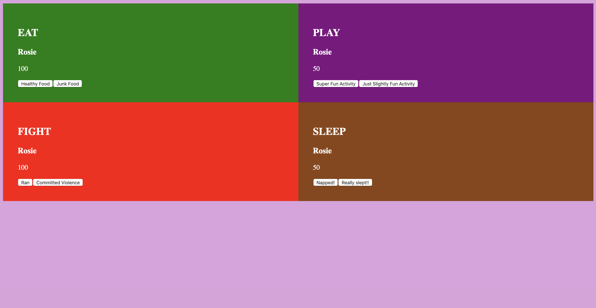

# Tamagotchi

## Description
This project is an exploration into using SCSS exclusively and continuing to hone our skills for structuring project files. It replicates a simple version of the 1990s' Tamagochi vitrual pest and their favorite activities. Users can record if their pet has eaten, played, fought, or slept, and each activity gets rewarded appropriately. Project instructions can be found [here](https://github.com/nss-nightclass-projects/exercise-vault/blob/master/MODULES_tamagotchi.md).

## Screenshots
##### Home Page

## How to Run
1. Clone down this repo.
1. Make sure you have http-server installed via npm. If not, get it [here](https://www.npmjs.com/package/http-server).
1. On your command line, run `hs -p 9999`.
1. In your browser, navigate to `http://localhost:9999`.
